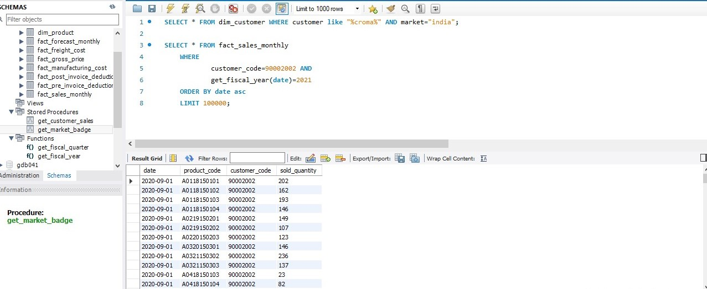

# customer_query.jpg

## Purpose
This file demonstrates creating **user-defined functions** in SQL and how they can simplify repetitive logic.  
It focuses on **calculating the fiscal year dynamically** and querying sales data for a specific customer.

## Explanation of Queries

1. **Grab customer codes for Croma India**  
   Helps identify the customer code needed for further analysis.

2. **Sales transactions for Croma in fiscal year 2021**  
   Fetches raw sales data using date arithmetic.

3. **Create `get_fiscal_year()` function**  
   Encapsulates fiscal year logic to make queries reusable.

4. **Use the function in a query**  
   Shows how to replace complex date logic with a simple function call.

## SQL Code

```sql
-- a. First grab customer codes for Croma India
SELECT * 
FROM dim_customer 
WHERE customer LIKE "%croma%" 
  AND market="india";

-- b. Get all the sales transaction data from fact_sales_monthly table for that customer (croma: 90002002) in fiscal year 2021
SELECT * 
FROM fact_sales_monthly 
WHERE customer_code=90002002
  AND YEAR(DATE_ADD(date, INTERVAL 4 MONTH))=2021
ORDER BY date ASC
LIMIT 100000;

-- c. Create a function 'get_fiscal_year' to get fiscal year by passing the date
CREATE FUNCTION `get_fiscal_year`(calendar_date DATE) 
RETURNS int
DETERMINISTIC
BEGIN
    DECLARE fiscal_year INT;
    SET fiscal_year = YEAR(DATE_ADD(calendar_date, INTERVAL 4 MONTH));
    RETURN fiscal_year;
END;

-- d. Replacing the function created in step b
SELECT * 
FROM fact_sales_monthly 
WHERE customer_code=90002002
  AND get_fiscal_year(date)=2021
ORDER BY date ASC
LIMIT 100000;
```


## Screenshot

**Customer Query Screenshot:**  



