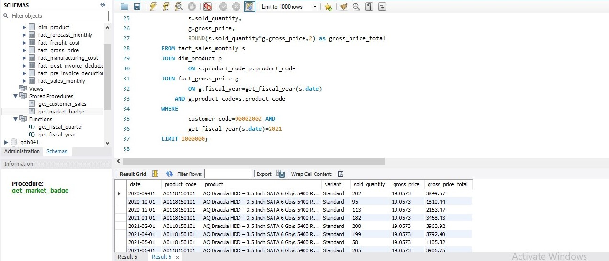

# 02_Gross_Sales_Report_Monthly.sql

## Purpose
Focuses on **joining tables** to enrich sales data with product details and calculate **gross sales per product**.

## Explanation of Queries

1. **Join product info**  
   Combines sales data with product details (`dim_product`) for better analysis.

2. **Join with gross price table**  
   Adds `gross_price` to calculate total sales value per product.

3. **Resulting dataset**  
   Shows monthly product-level sales for a customer, ready for reporting.

## SQL Code

```sql
-- a. Perform joins to pull product information
SELECT s.date, s.product_code, p.product, p.variant, s.sold_quantity 
FROM fact_sales_monthly s
JOIN dim_product p
    ON s.product_code=p.product_code
WHERE customer_code=90002002 
  AND get_fiscal_year(date)=2021
LIMIT 1000000;

-- b. Performing join with 'fact_gross_price' table with the above query and generating required fields
SELECT 
    s.date, 
    s.product_code, 
    p.product, 
    p.variant, 
    s.sold_quantity, 
    g.gross_price,
    ROUND(s.sold_quantity*g.gross_price,2) AS gross_price_total
FROM fact_sales_monthly s
JOIN dim_product p
    ON s.product_code=p.product_code
JOIN fact_gross_price g
    ON g.fiscal_year=get_fiscal_year(s.date)
   AND g.product_code=s.product_code
WHERE customer_code=90002002 
  AND get_fiscal_year(s.date)=2021
LIMIT 1000000;
```

## Screenshot

**Gross Sales Report: Monthly Product Transactions:**  

