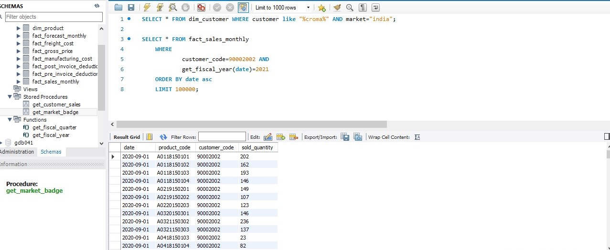
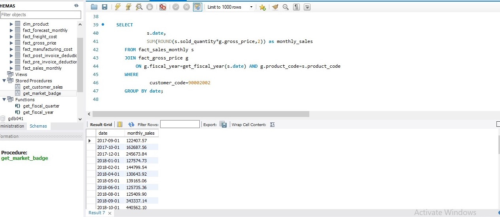
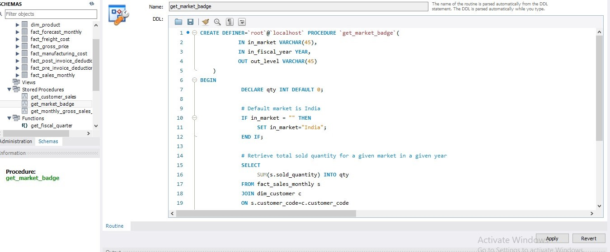

# Finance SQL Analytics Project

## Overview
This project demonstrates **advanced SQL analytics techniques** applied to financial sales data. It includes **user-defined functions, joins, stored procedures, and reporting** to analyze customer and product sales.  

The purpose is to showcase **SQL skills in a real-world finance scenario**, which is highly relevant for roles like **Data Analyst, Business Analyst, or SQL Developer**.

---

## Skills Demonstrated
- Writing **User-Defined SQL Functions**
- Performing **Joins and Aggregations**
- Writing **Stored Procedures**
- Financial Data Analysis & Reporting
- Business-level Insights (Market Badge, Sales Trends)

---

## Repository Structure

## Repository Structure

- **Finance-SQL-Analytics/**
  - `README.md`
  - **screenshots/** (Query result screenshots)
    - `customer_query.jpg`
    - `monthly_product_sales.jpg`
    - `total_monthly_sales.jpg`
    - `get_monthly_gross_sales_for_customer.jpg`
    - `get_market_badge.jpg`
  - **SQL_Scripts/** (SQL scripts by module)
    - `01_customer_query.md`
    - `02_Gross_Sales_Report_Monthly.md`
    - `03_Total_Sales_Report.md`
    - `04_Stored_Procedures_Monthly_Gross.md`
    - `05_Stored_Procedure_Market_Badge.md`
  

---

## Modules

### 1. User-Defined SQL Functions
- Fetch customer codes for a specific market
- Create function `get_fiscal_year()` to calculate fiscal year dynamically
- Demonstrate usage of the function in queries  

**Screenshot:**  

---

### 2. Gross Sales Report: Monthly Product Transactions
- Join sales data with product table
- Calculate monthly gross sales per product
- Include `gross_price` calculations  

**Screenshot:**  

---

### 3. Gross Sales Report: Total Sales Amount
- Aggregate monthly sales for a specific customer
- Demonstrates `SUM()` and grouping for reporting  

**Screenshot:**  

---

### 4. Stored Procedures: Monthly Gross Sales Report
- Reusable procedure to generate monthly gross sales for any customer(s)
- Demonstrates **dynamic input handling** with `FIND_IN_SET()`  

**Screenshot:**  

---

### 5. Stored Procedure: Market Badge
- Procedure to assign “Gold” or “Silver” badge to a market
- Demonstrates conditional logic and **OUT parameters** in SQL  

**Screenshot:**  

---

## Connect with Me

- **LinkedIn:** [www.linkedin.com/in/akshay-mangutkar](www.linkedin.com/in/akshay-mangutkar)
- **LinkedInPost:** [[link](https://www.linkedin.com/feed/update/urn:li:activity:7370755952872132608/))
- **Portfolio:** (https://codebasics.io/portfolio/Akshay-Mangutkar)]((https://codebasics.io/portfolio/Akshay-Mangutkar))

