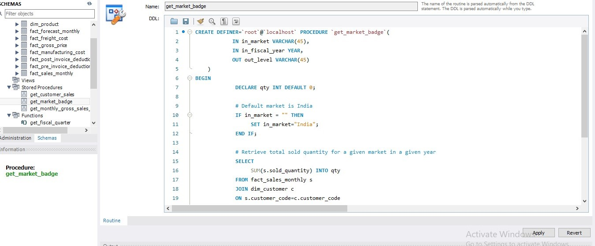

# 05_Stored_Procedure_Market_Badge.sql

## Purpose
Performs **market-level analytics** using a stored procedure, determining a **“Gold” or “Silver” badge** based on total sales quantity.

## Explanation of Procedure

### Input Parameters
- **in_market** – Target market (default “India” if empty).  
- **in_fiscal_year** – Fiscal year for analysis.

### Logic
- Sums total sold quantity for the market and fiscal year.  
- Determines market level: **>5 million = Gold**, else Silver.  

### Output Parameter
- **out_level** – Returns the market badge dynamically.

### Business Insight
Quickly identifies **high-performing markets** for reporting or strategy.

## SQL Code

```sql
-- Write a stored procedure that can retrieve market badge
-- i.e., if total sold quantity > 5 million that market is "Gold", else "Silver"
CREATE PROCEDURE `get_market_badge`(
    IN in_market VARCHAR(45),
    IN in_fiscal_year YEAR,
    OUT out_level VARCHAR(45)
)
BEGIN
    DECLARE qty INT DEFAULT 0;

    # Default market is India
    IF in_market = "" THEN
        SET in_market = "India";
    END IF;

    # Retrieve total sold quantity for a given market in a given year
    SELECT SUM(s.sold_quantity) INTO qty
    FROM fact_sales_monthly s
    JOIN dim_customer c
        ON s.customer_code = c.customer_code
    WHERE get_fiscal_year(s.date) = in_fiscal_year
      AND c.market = in_market;

    # Determine Gold vs Silver status
    IF qty > 5000000 THEN
        SET out_level = 'Gold';
    ELSE
        SET out_level = 'Silver';
    END IF;
END;
```
## Screenshot

**Stored_Procedure_Market_Badge:**  

