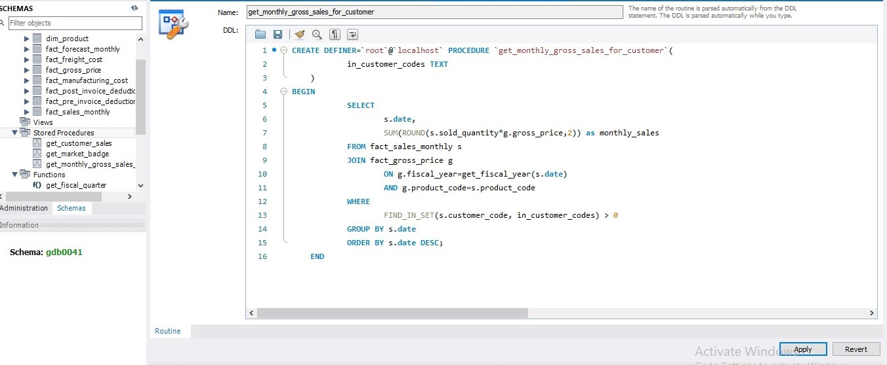

# 04_Stored_Procedures_Monthly_Gross.sql

## Purpose
Shows how to create **reusable stored procedures** for dynamic reporting, so multiple customers’ monthly sales can be fetched with a single procedure.

## Explanation of Procedure

1. **Input parameter `in_customer_codes`**  
   Accepts one or more customer codes.

2. **Dynamic filtering**  
   Uses `FIND_IN_SET()` to handle multiple customer codes.

3. **Aggregation by date**  
   Returns monthly sales for the requested customer(s).

4. **Reusable & maintainable**  
   Makes reporting consistent and reduces repetitive queries.

## SQL Code

```sql
-- Generate monthly gross sales report for any customer using stored procedure
CREATE PROCEDURE `get_monthly_gross_sales_for_customer`(
    in_customer_codes TEXT
)
BEGIN
    SELECT 
        s.date, 
        SUM(ROUND(s.sold_quantity * g.gross_price, 2)) AS monthly_sales
    FROM fact_sales_monthly s
    JOIN fact_gross_price g
        ON g.fiscal_year = get_fiscal_year(s.date)
       AND g.product_code = s.product_code
    WHERE FIND_IN_SET(s.customer_code, in_customer_codes) > 0
    GROUP BY s.date
    ORDER BY s.date DESC;
END;
```

## Screenshot 
**Stored_Procedures_Monthly_Gross:** 
